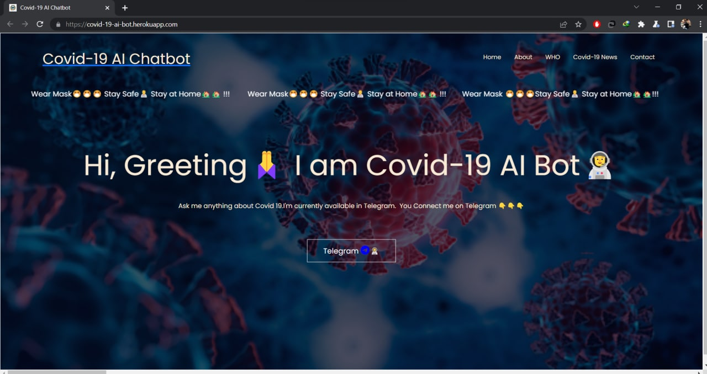
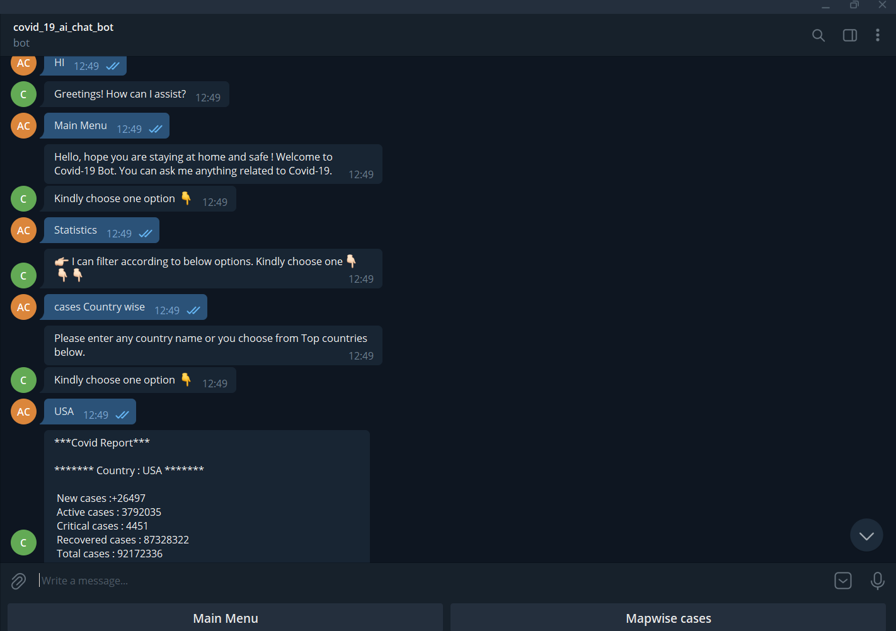
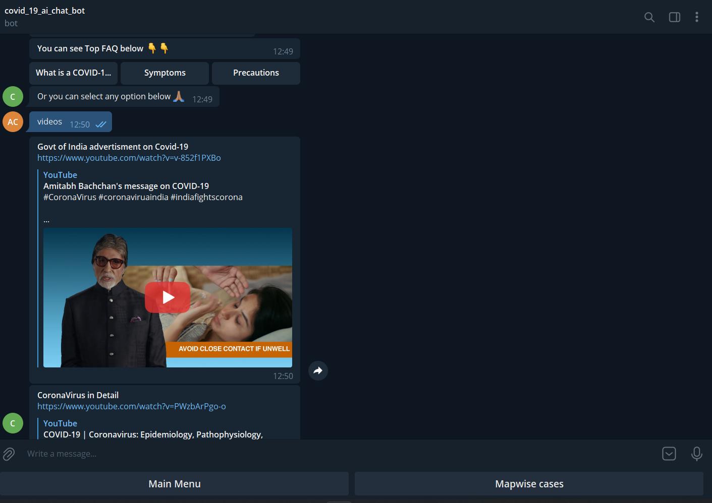
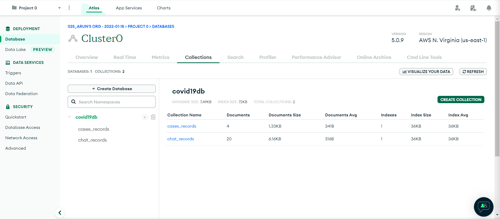
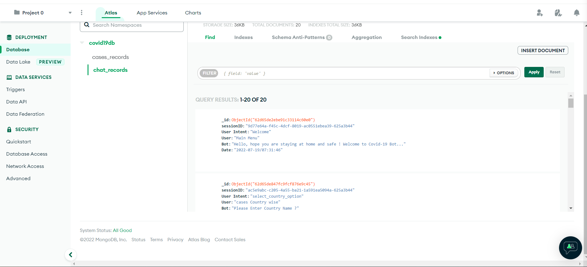
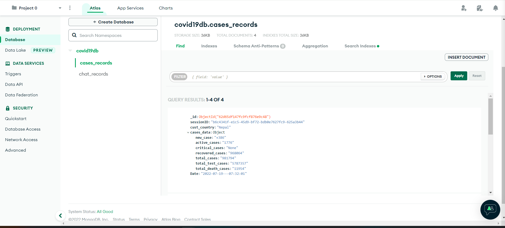

# Covid-19_AI_Chatbot


## Software and Account Requirements 
1. [Github Account](https://github.com/)
2. [Heroku Account](https://id.heroku.com/login)
3. [Dialogflow](https://dialogflow.cloud.google.com/)
4. [VS Code IDE](https://code.visualstudio.com/download)
5. [GIT CLI](https://git-scm.com/downloads)
6. [Rapidapi](https://rapidapi.com/)


[Deployment link](https://covid-19-ai-bot.herokuapp.com/)


```
Deployment link :- https://covid-19-ai-bot.herokuapp.com/ 
```
```
UI:


```

```
Bot-Conversation:




```

```
Databases:






```

```
Email:


```

```

```
